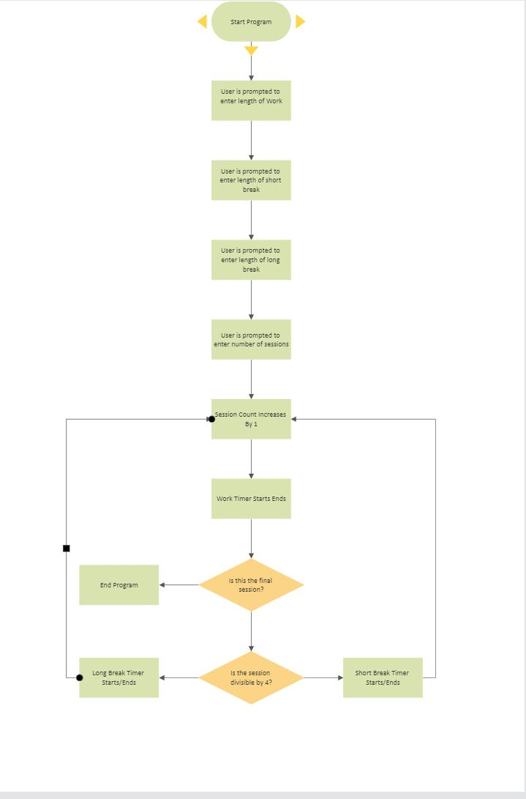
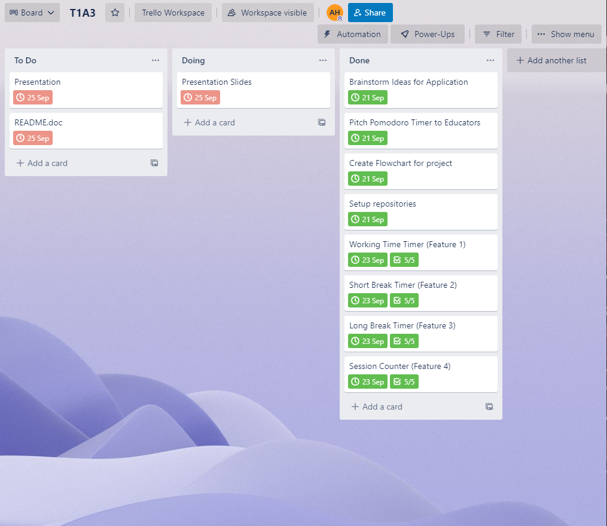
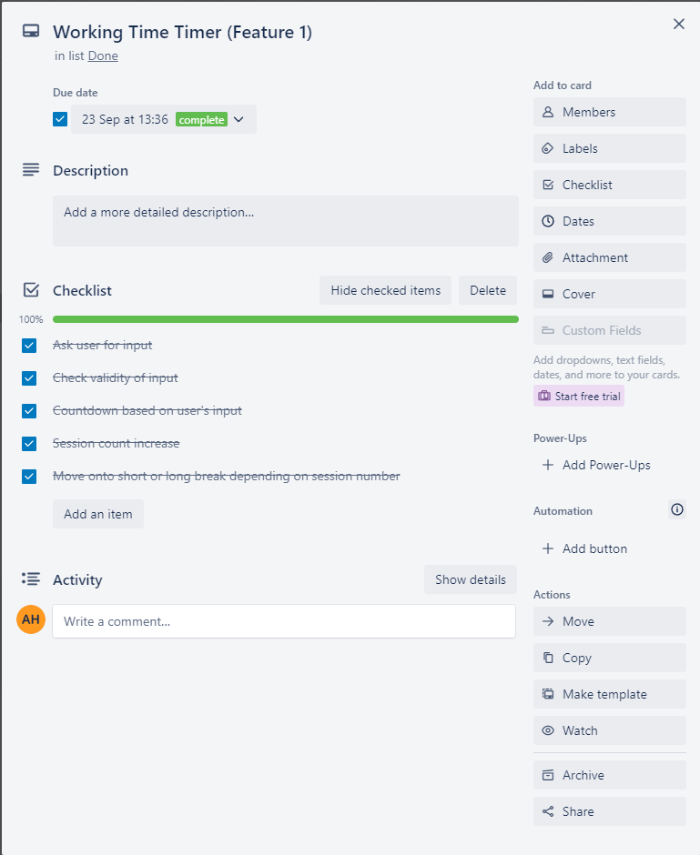
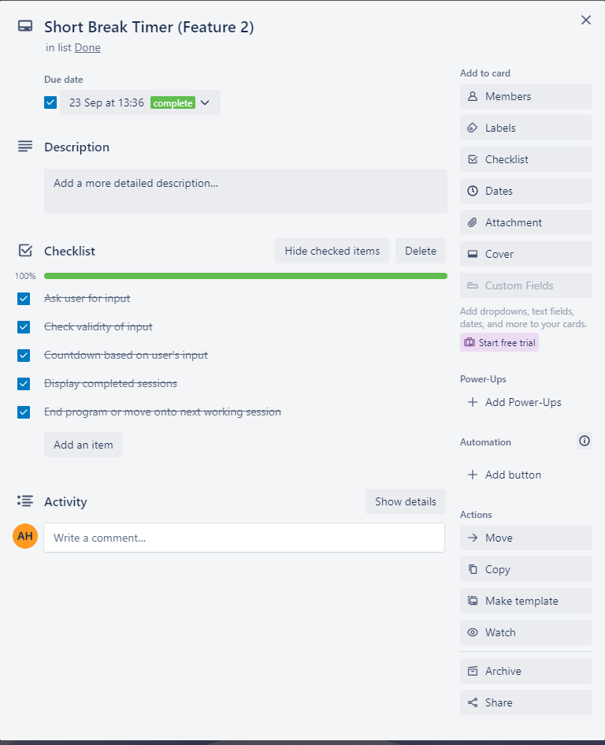
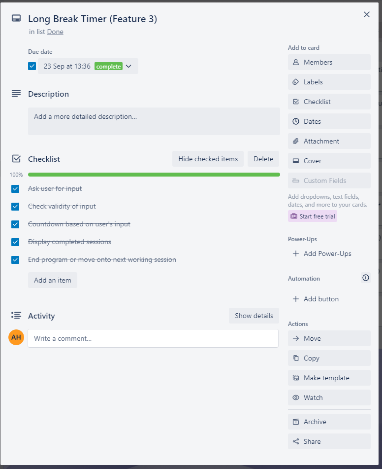
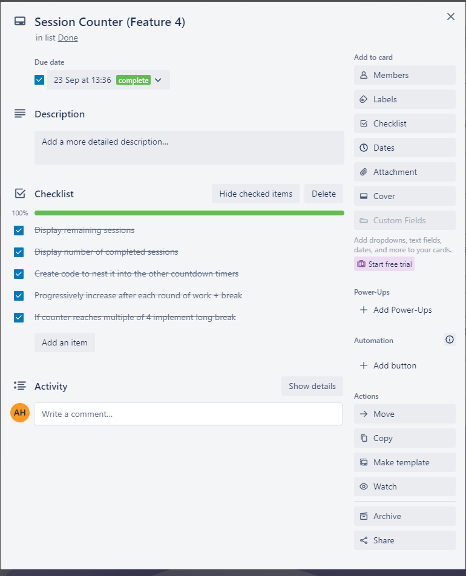

# Anthony Huynh - T1A3 Terminal Application

---

## Table of Contents

[**Link to Source Control Repository (R4)**](#link-to-source-control-repository-r4)

[**Overview of Terminal Application**](#overview-of-terminal-application)

[**Flow Chart**](#flow-chart)

[**Features**](#features-r6)

- [Feature 1: Work Timer](#feature-1-working-timer)
- [Feature 2: Short Break Timer](#feature-2-short-break-timer)
- [Feature 3: Long Break Timer](#feature-3-long-break-timer)
- [Feature 4: Session Counter](#feature-4-session-counter)

[**Implementation Plan**](#implementation-plan-r7)

[**Installation Instructions**](#installation-instructions-r8)

[**Style Guide (R5)**](#style-guide-r5)

[**Referenced Sources (R3)**](#referenced-sources-r3)


## Link to Source Control Repository (R4)

### [Github Repo](https://github.com/antohuynh/AnthonyHuynh_T1A3)

### [Trello Board](https://trello.com/b/qBlJ2AUS/t1a3)

### [Presentation Video](https://youtu.be/OElkHeih4ho)

### [Presentation Slides](ppt/slides.pdf)

## Overview of Terminal Application

The purpose of this application is to enable the user to employ the Pomodoro technique in a command line environment. The Pomodoro technique was created by Francesco Cirrilo and is one of the most popular productivity methods used today.

This application will aim to repplicate the key features which make the Pomodoro technique so popular, whilst also allowing a more tailored experience through the customisable work and break load lengths. 

## Flow Chart



## Features (R6)

### **Feature 1: Working Timer**

Traditionally in the Pomodoro technique, a standard 25minutes is allocated for working time. In Katchup users are able to input their desired work time enabling a more flexible and user tailored experience. It also allows users to experiment with different working loads in order to find what works best for them.

```python
def countdown(interval):
    for j in range (interval-1,-1,-1):
        for i in range(59,-1,-1):
            if i <= 9:
                sys.stdout.write \
                (f'\rDuration: {j} Minute(s) 0{i} Seconds  to go')
            else:
                sys.stdout.write \
                (f'\rDuration: {j} Minute(s) {i} Seconds to go')
            time.sleep(1)
```

Above is the code for the timer itself which is commonly used amongst all the timers within the program. It employs a negative step to essentially "count down" from the given time. It then displays the time remaining back to the user in the form of Minutes and Seconds remaining.

### **Feature 2: Short Break Timer**

The main idea behind the pomodoro technique is to implement a sufficient amount of breaks inbetween working loads in order to maximise productivity and prevent burn outs. This is another value which is user chosen as a global 5 minute break, may not work for all and the option to adjust break length can be crucial especially during long strenuous sessions. 

```python
       while session_count < total_duration:
        # Work timer that displays how many sessions are remaining
        print(f'\nKeep Grinding! You\'ve got {total_duration - session_count} Katchups remaining!')
        countdown(interval)
        session_count += 1

        if session_count%4 == 0 and session_count!=total_duration:
            print('\nGreat Work! It\'s time for a long break!')
            countdown(long_break)
        # Short break timer that adds 1 to session count when finished
        else:
            print('\nWell Done! You\'ve earned yourself a short break!')
            countdown(short_break)
            print('\nKatchups Completed: ',session_count, '/',total_duration)  
```
As displayed in the code above, the code for the short break is implemented so long as the session number is not divisible by 4, this is because traditionally after 4 Pomodoro sessions a long break is recommmended to give the brain a reset. The short break timer also displays the remaining number of sessions based on the data it received from the user.

### **Feature 3: Long Break Timer**

Another crucial feature is the implementation of a long break inbetween sets of 4 sessions. This longer break allows users to complete tasks which otherwise wouldn't be possible during a short break. The long break occurs after every 4 working sets and is also set by the user at the beginning. It is crucial to note that if the total amount of sessions specified by the user is divisible by 4, once the final working session is completed the program will end and not complete another iteration of the long break. This was done on purpose as I assumed the entire session could be deemed as finished after the final working session has completed and not the break.


### **Feature 4: Session Counter**

Finally a simple but very convenient feature is the session counter. This displays the number of sessions completed by the user following the respective break as well providing the user with the number of sessions remaining. This was implemented in order to provide the user with the ability to track their progress and was implemented in accordance with the timers in order to maximise efficiency and readability.

```python
if __name__ == '__main__':

    session_count = 0
    interval, short_break, long_break, total_duration = user_input()

    while session_count < total_duration:
        # Work timer that displays how many sessions are remaining
        print(f'\nKeep Grinding! You\'ve got {total_duration - session_count} Katchups remaining!')
        countdown(interval)
        session_count += 1
```

## Implementation Plan (R7)

The implementation plan of this project was completed solely on Trello. The use of such a plan was utilised in order to segment the entire projects into smaller much simpler tasks with individual due dates and prioritiy settings. 












## Installation Instructions (R8)

1. Open your terminal 
2. Create a new directory us "mkdir 'directory-name'"
3. Open this directory and enter the following command in terminal:

   ```git clone https://github.com/antohuynh/AnthonyHuynh_T1A3```

4. Navigate into the folder by entering the following command:

   ```cd AnthonyHuynh_T1A3```

5. Change the permissions on the script file by running the following command:

   ```chmod +x src/katchup.sh```

6. To run the terminal application, use the following command:

    ```./src/katchup.sh```

## System Dependencies & Requirements

There are no system dependencies or hardware requirements for this application.

This application will require Python to run. If you don't have Python installed, please visit <https://python.org/downloads/> to download the latest version.

## Style Guide (R5)

The python code for this project conforms to the standards set out in the PEP 8 Style Guide for Python.

## Referenced Sources (R3)

[Pomodoro Technique by Francesco Cirrilo]
[PEP 8 – Style Guide for Python Code](https://peps.python.org/pep-0008/)